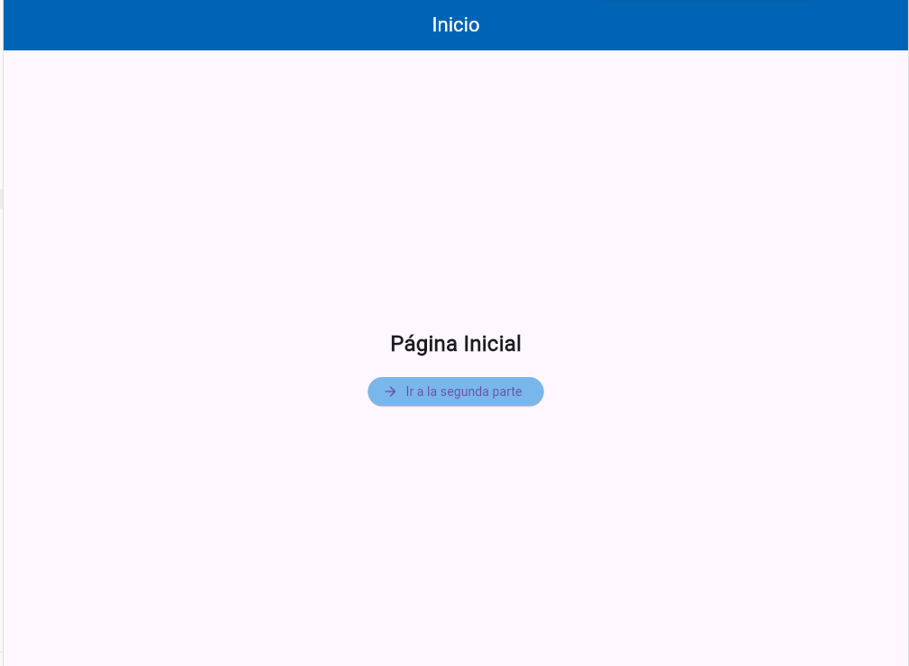
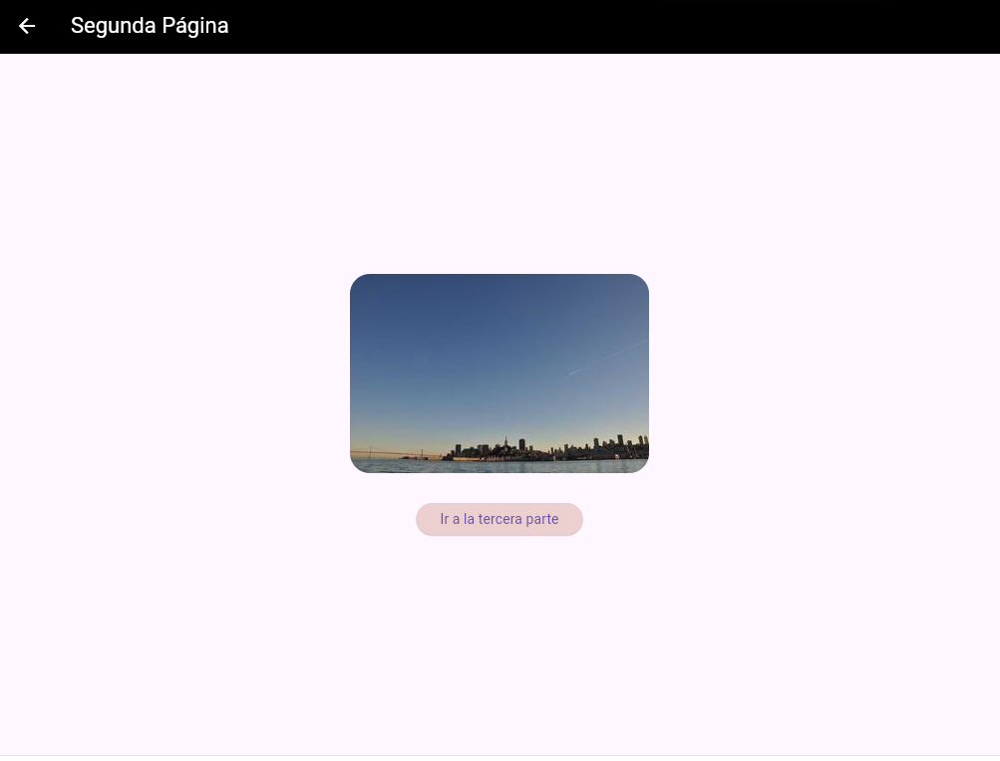
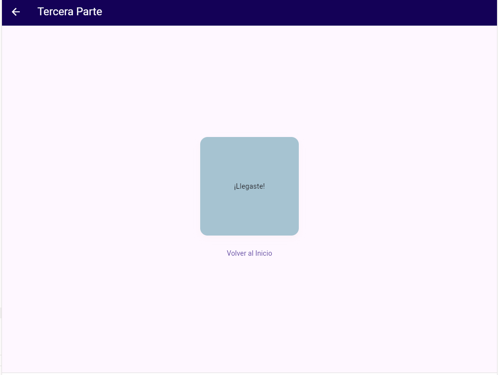

# myapp

A new Flutter project.

## Getting Started
## mi prompt navegacion 3 paginas 
lenguaje dart flutter ,nivel principiante,ejemplo de navegacion entre 3 pantallas utilizando rutas nombradas ,desde main llamar a la pagina 1,en la pagina uno mostrar el appbar el titulo "inicio" color blanco con fondo azul y en body,en una columna mostrar texto (pagina iniciar) mas un boton ,para ir a la segunda parte ,en la segunda pagina mostrar el appbar "segunda pagina" color negro con fondo verde  y en body mostrar una imagen desde la red mas un boton para ir a la tercera parte ,en la tercera pagina en appbar mostrar titulo"tercera parte"color rosa con fondo azul  marino y en body mostrar un container de 200 por 200 azul claro .todo esto debe de ser atractivo facil navegacion y mostrar todo el codigo en un solo archivo

This project is a starting point for a Flutter application.

A few resources to get you started if this is your first Flutter project:

- [Lab: Write your first Flutter app](https://docs.flutter.dev/get-started/codelab)
- [Cookbook: Useful Flutter samples](https://docs.flutter.dev/cookbook)

For help getting started with Flutter development, view the
[online documentation](https://docs.flutter.dev/), which offers tutorials,
samples, guidance on mobile development, and a full API reference.
